# Group Policy Management (GPO)

> * Windows Infrastructure and Security*

---

## 🎯 The Mission

Group Policy is how Windows administrators push configuration changes to thousands of machines at once — or just the right machines at the right time. This lab was my deep-dive into the mechanics of GPO creation, linking, enforcement, precedence, and security filtering.

By the end of this lab, I understood not just *how* to create GPOs, but *why* they behave the way they do — which is what separates a sysadmin from a Windows infrastructure engineer.

---

## 🔧 Environment

| Component | Value |
|-----------|-------|
| Domain | `ooje8461Labs.local` |
| Test Users | John Jones (`jjones`), Sally Smith (`ssmith`) |
| Security Groups | `G_HR_Staff`, `G_Ops_Staff` |
| OUs | Employees OU |
| Member Server | MS VM (accessed via RDP) |

---

## 📋 The GPO Experiment — Step by Step

This lab was structured as a series of deliberate experiments, each designed to expose a specific GPO behavior. The vehicle: **desktop wallpaper** — trivial to see, perfect for proving a point.

---

### Experiment 1: Basic GPO Creation and Linking

**GPO Created:** `stewie` — sets the desktop wallpaper to `stewie.jpg`
**Linked to:** Domain level

**Result:** Logged in as `ssmith` → stewie.jpg wallpaper appeared on the desktop ✅

> This confirmed the basic GPO delivery pipeline: create → link → gpupdate → effect.

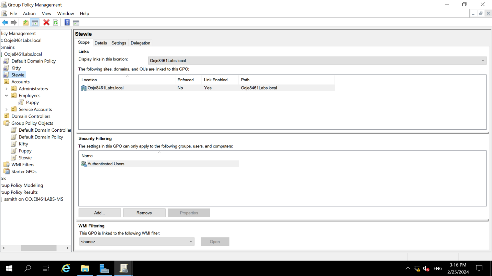

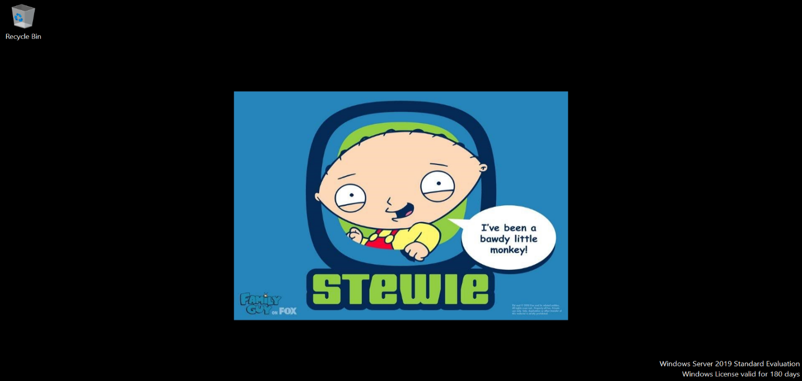

---

### Experiment 2: Block Inheritance

**Action:** Blocked Group Policy inheritance on the **Employees OU**
**Action:** Forced `gpupdate /force` on the member server

**Result:** ssmith's wallpaper reverted to the **default Windows wallpaper** ✅

> Blocking inheritance shields an OU from GPOs linked higher up the hierarchy. Useful for departments with different security requirements — but also the source of "why isn't my GPO applying?" headaches.

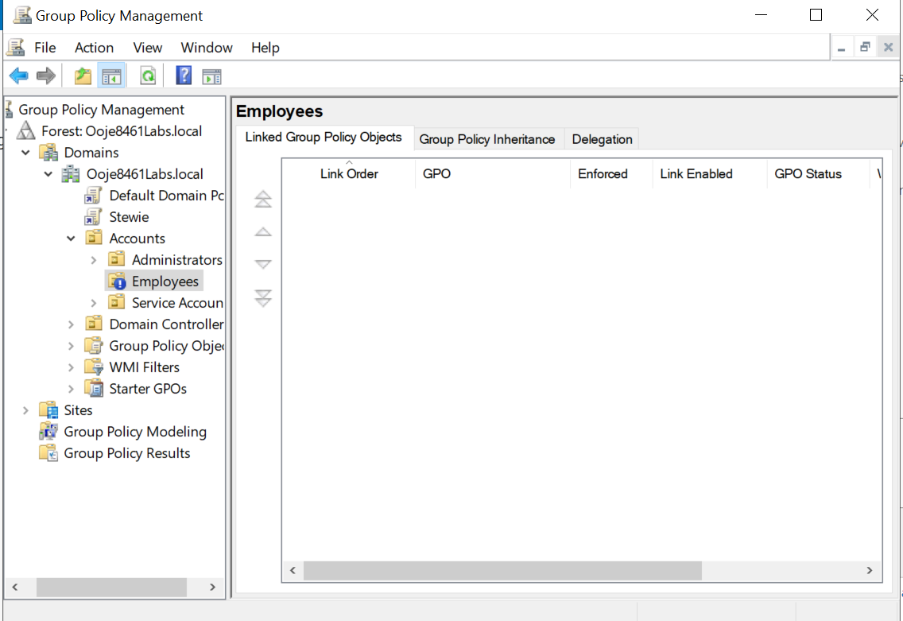

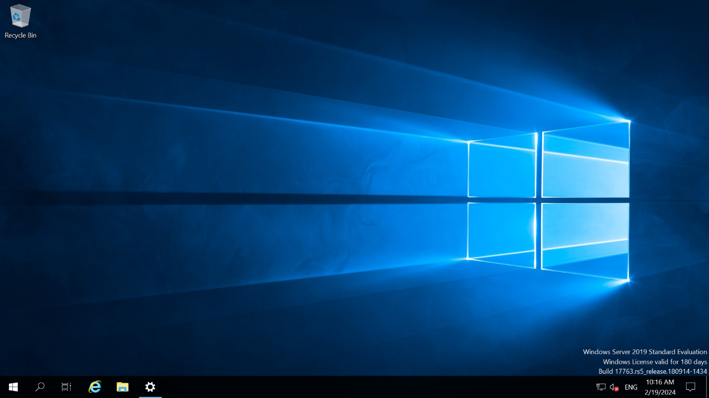

---

### Experiment 3: Enforce Overrides Block

**Action:** Set the `stewie` GPO link to **Enforced**

**Result:** stewie.jpg wallpaper returned — *despite* inheritance still being blocked on Employees OU ✅

> **Enforced (No Override) wins against Block Inheritance.** An enforced GPO propagates through any blocking. This is by design — it gives domain admins the ability to mandate settings regardless of OU-level resistance.

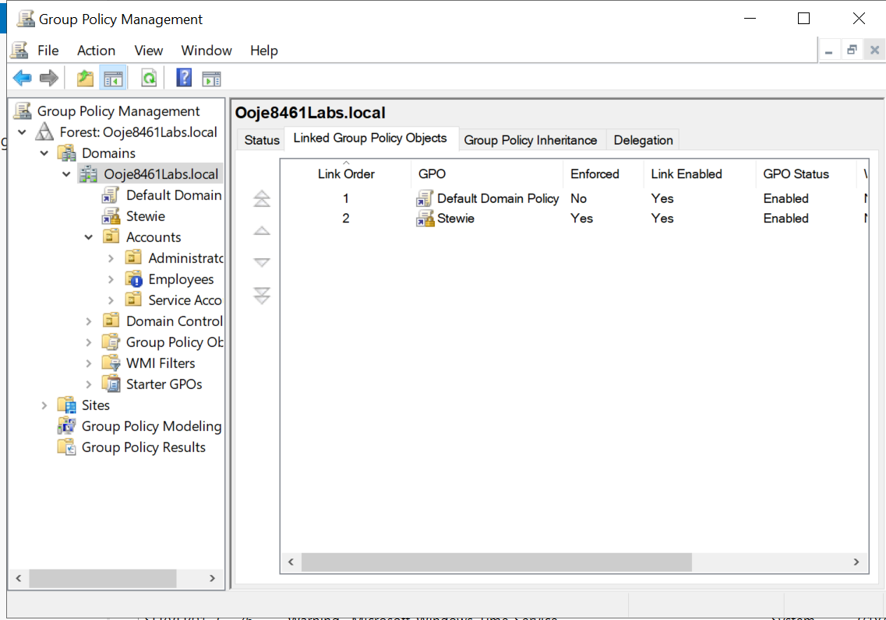

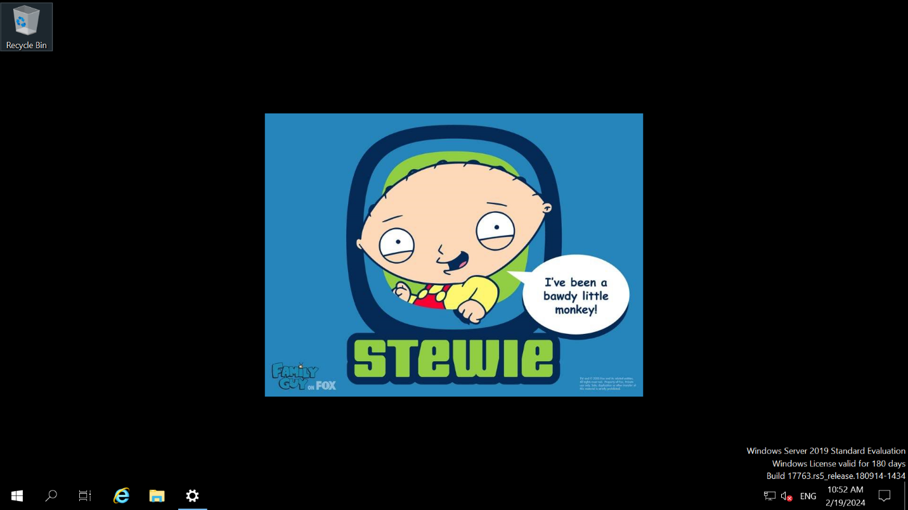

---

### Experiment 4: Multiple GPOs — Processing Order Determines Winner

**GPO Created:** `kitty` — sets wallpaper to `cat.jpg`, also linked at domain
**Initial order:** stewie (order 1) → kitty (order 2)

**Result:** ssmith showed `stewie.jpg` — not `cat.jpg` ✅

> With multiple GPOs at the same level, **lower processing order number = higher precedence**. stewie at order 1 won.

**Reversed order:** kitty (order 1) → stewie (order 2)

**Result:** ssmith now showed `cat.jpg` ✅

> Reversing the order switched the winner. This is exactly how you troubleshoot conflicting GPOs in production.

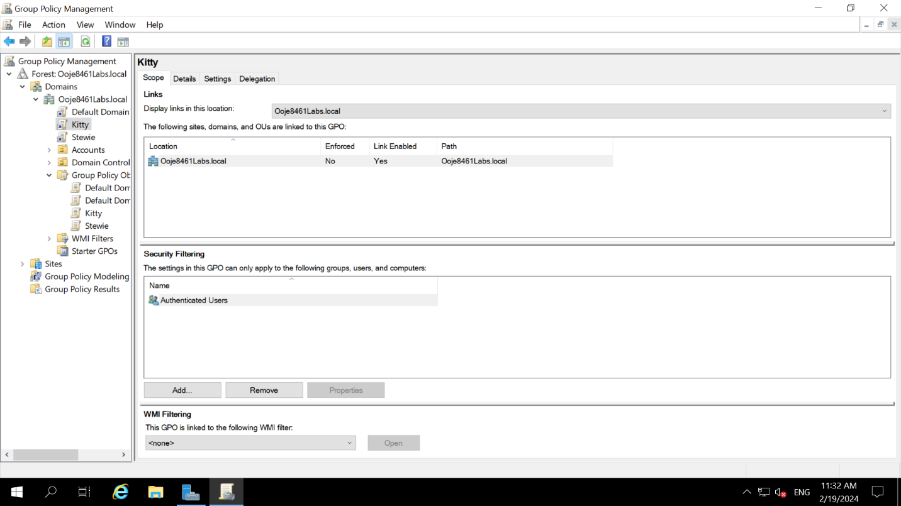

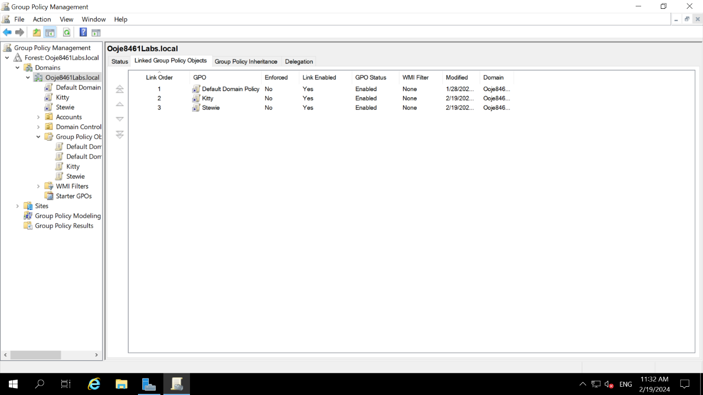


---

### Experiment 5: Disable a GPO Link

**Action:** Disabled the link to the `kitty` GPO

**Result:** ssmith reverted to `stewie.jpg` ✅

> Disabling a link removes a GPO's effect without deleting it — ideal for testing or temporarily suspending a policy.


---

### Experiment 6: OU-Level GPO

**GPO Created:** `puppy` — sets wallpaper to `dog.jpg`
**Linked to:** Employees OU (not domain)

**Result:** ssmith (in Employees OU) showed `dog.jpg` ✅

> GPOs linked to a specific OU only apply to objects *in* that OU. More targeted = more precise control.

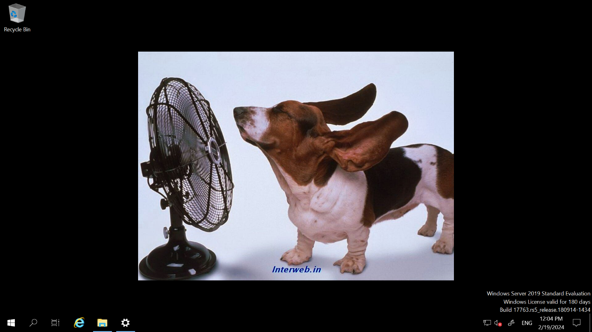

---

### Experiment 7: Security Filtering — The Power Move

This was the most important experiment in the lab.

**stewie GPO** → Security Filtering → **G_Ops_Staff only**
**kitty GPO** → Security Filtering → **G_HR_Staff only**

- `ssmith` is in `G_HR_Staff`
- Logged in as ssmith → `cat.jpg` wallpaper (from kitty, which targets HR) ✅
- stewie (targeting Ops staff) was ignored

> **Security filtering** lets you apply a GPO to specific groups within a linked scope — the most surgical targeting tool in Group Policy. This is what makes enterprise policy management scalable.

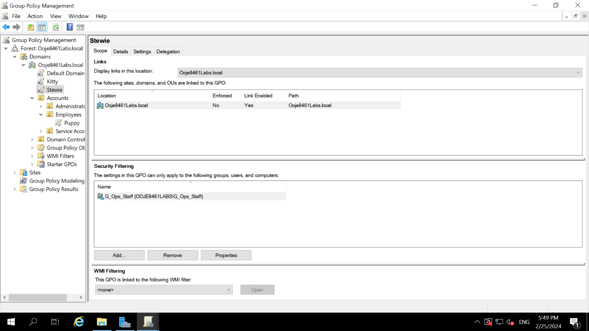


---

### Experiment 8: Group Policy Results Wizard

**Action:** Configured firewall rules on the MS VM to allow policy results reporting
**Action:** Ran the Group Policy Results Wizard targeting `ssmith` on the MS VM

**Result:** Generated a full report showing exactly which GPOs applied, which were filtered, and why.

> In production, the **GP Results Wizard** (and `gpresult /r`) are your first line of diagnosis when GPOs aren't applying as expected. I know how to use them.

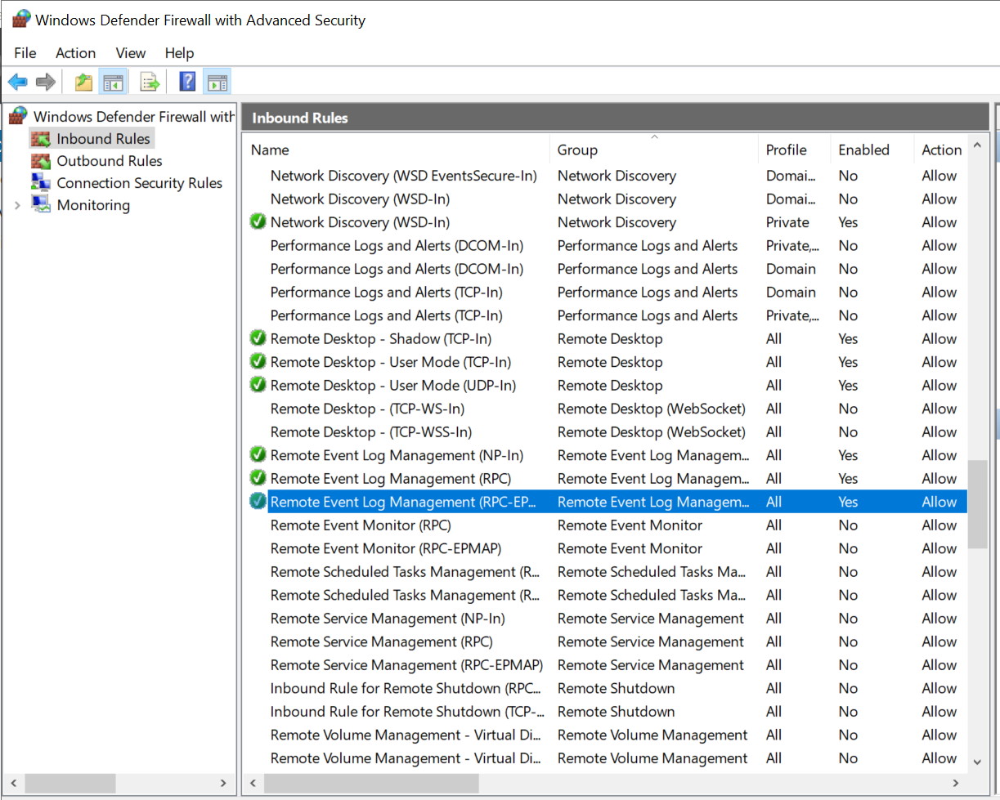

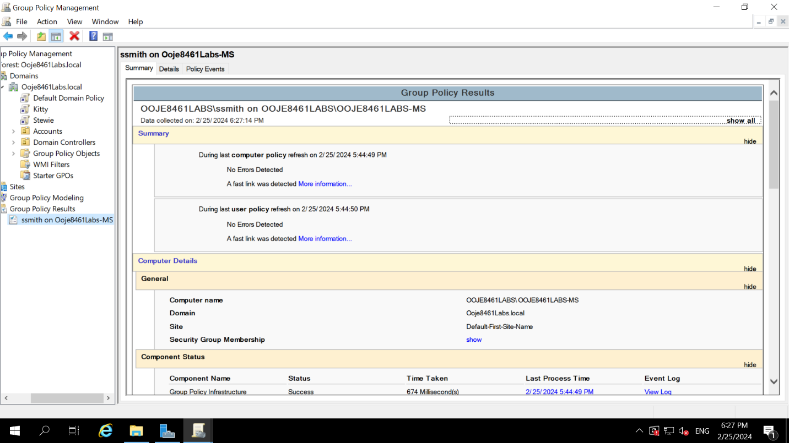

---

## 📊 GPO Precedence Summary

```
Higher Precedence
      ▲
      │  Enforced GPO (No Override)
      │  Local GPO
      │  Site GPO
      │  Domain GPO
      │  OU GPO
      │  Child OU GPO (closest to object)
      ▼
Lower Precedence (overwritten by above)

Note: Within the same level, lower Link Order number = higher precedence
Block Inheritance: Stops non-enforced GPOs from above
Enforce: Ignores Block Inheritance
Security Filtering: Restricts *who* a GPO applies to within its scope
```

---

## 💡 Key Takeaways

1. **GPO precedence** isn't magic — it follows deterministic rules (LSDOU + link order). Understanding the rules means never being surprised by policy behavior.

2. **Enforce vs. Block Inheritance** is the power struggle at the heart of GPO design. Enforce always wins — use it carefully.

3. **Security filtering** is the right tool when you need a GPO to apply to a subset of users/computers within a linked scope — far better than duplicating GPOs.

4. **GPO Results Wizard** is essential for diagnosing policy issues in the field. I know how to configure the firewall to enable it and how to read the output.

---

[← Lab 02: File System Permissions](../02-file-system-permissions/README.md) | [Next: WSUS Patch Management →](../04-wsus-patch-management/README.md)
