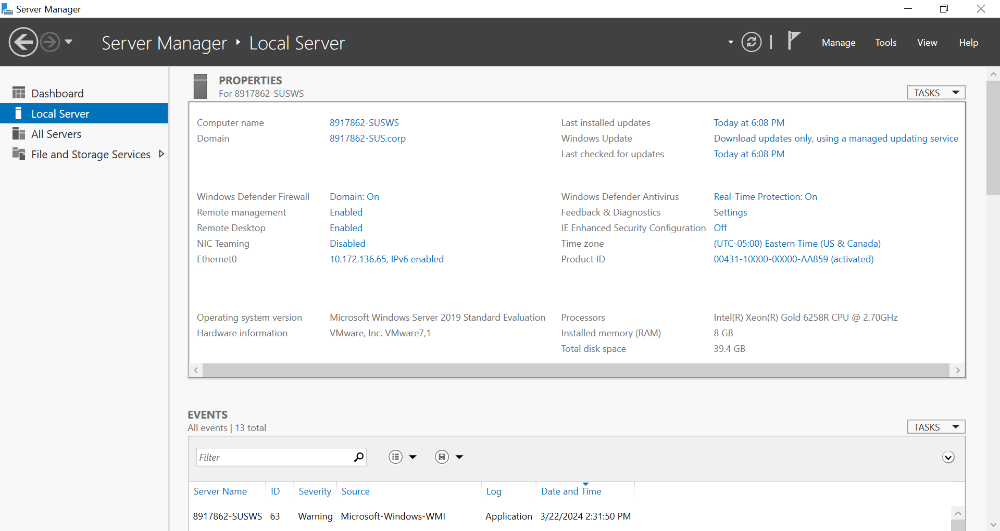
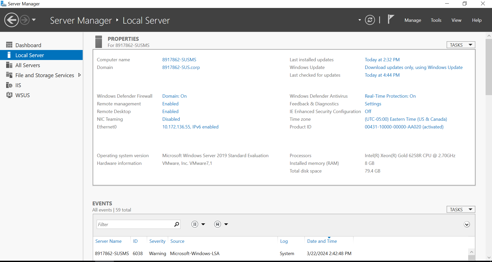
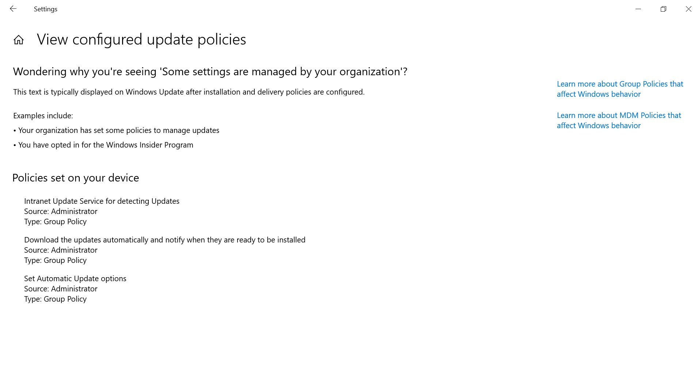
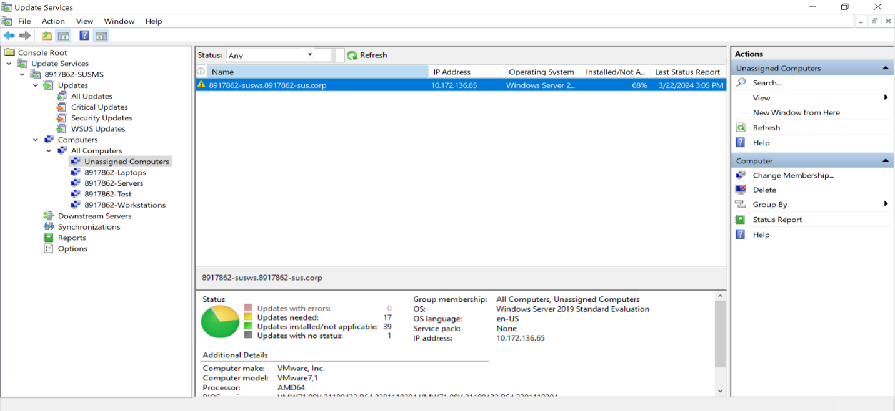
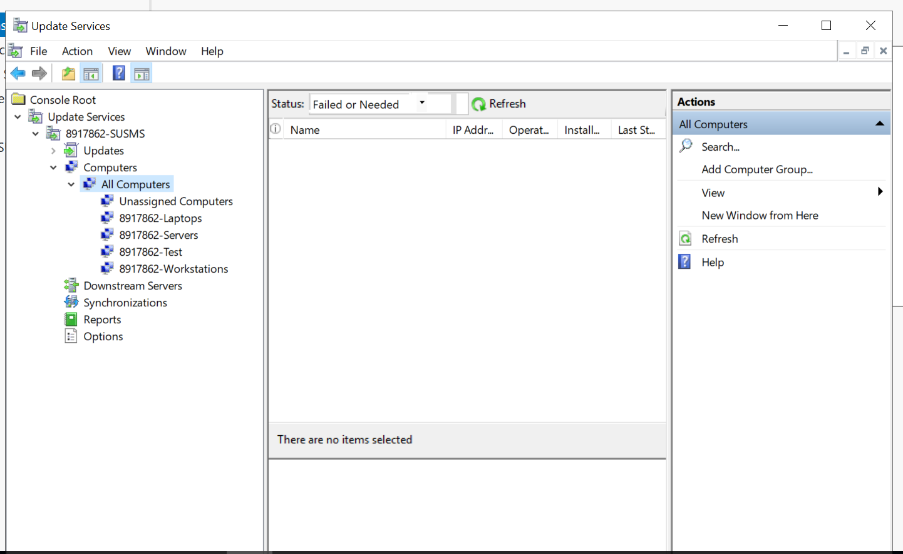
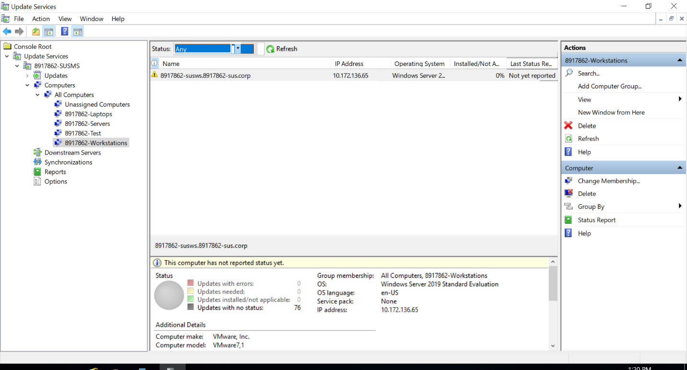
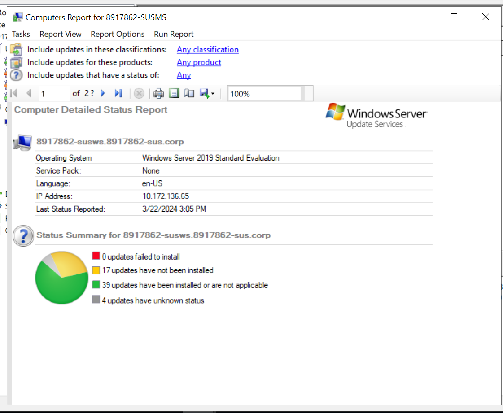
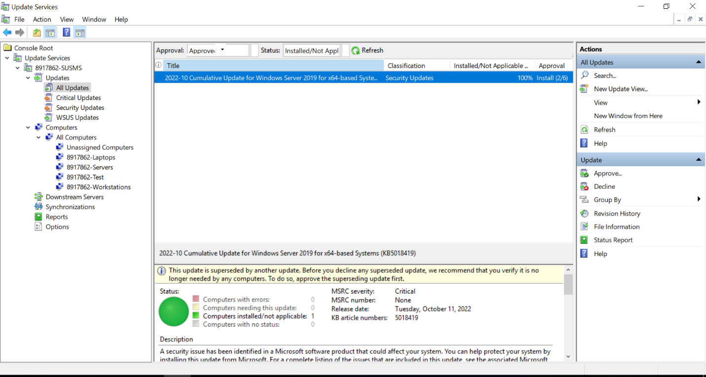

# 04 — WSUS: Centralized Patch Management

> *Lab 3 (Part A) · INFO 8461 · Windows Infrastructure and Security*

---

## 🎯 The Mission

Unpatched systems are the #1 attack vector in enterprise environments. Windows Server Update Services (WSUS) is how organizations take back control of the patching process — deciding *what* gets deployed, *when*, and *to whom*, without relying on every workstation reaching out to Microsoft directly.

This lab built a fully functional WSUS infrastructure from scratch.

---

## 🔧 Environment

| VM | IP Address | Role |
|----|-----------|------|
| 8917862-SUSDC | 10.172.136.45 | Domain Controller |
| 8917862-SUSMS | 10.172.136.65 | WSUS Server (Member Server, 40GB extra disk) |
| 8917862-SUSWS | 10.172.136.55 | Client Workstation |
| Domain | `8917862-SUS.corp` | |

Three VMs, isolated network, fresh domain — a realistic test environment for update infrastructure.

---

## 📋 Part 1 — Install Windows Server Update Services

### Why IIS Matters Here

WSUS doesn't exist in isolation — it depends on **Internet Information Services (IIS)** as its web platform. IIS provides the HTTPS transport layer that client machines use to pull updates from the WSUS server. Without a properly configured IIS, WSUS has no reliable channel to distribute updates or accept status reports from clients.

> IIS isn't just a dependency to check off — it's the security layer ensuring update payloads are delivered over authenticated, structured HTTP connections rather than raw file transfers.

### Screenshots

**Computer name configured for WSUS server**





---

## 📋 Part 2 — Configure WSUS and Workstation Client

### Configuration Steps

1. Completed the WSUS post-install configuration — specifying upstream sync source (Microsoft Update), product selections, and classification choices
2. Configured the **workstation VM** to point to the internal WSUS server via Group Policy
3. Forced a client check-in — confirmed the workstation appeared in WSUS as an **Unassigned computer**

### The Value of In-House Update Servers

Deploying an internal WSUS server instead of relying on direct Microsoft Update access provides three critical advantages:

**1. Controlled Deployment**
Organizations can test updates in a pilot group before broad deployment — preventing a bad patch from bricking production systems. The patch that broke your finance system on a Monday morning? WSUS with staged rollouts prevents that.

**2. Security Boundary**
Workstations pulling updates from an internal server never need outbound internet access to Microsoft's CDN. This reduces attack surface and allows organizations to enforce access controls on the update pipeline itself.

**3. Bandwidth Conservation**
Instead of 500 workstations each downloading a 500MB cumulative update from Microsoft, the WSUS server downloads it once and distributes internally. At scale, this saves tens of gigabytes of internet bandwidth per patch cycle.

### Screenshots

**Workstation pointing to WSUS server (private network)**



**Workstation appearing in WSUS as Unassigned**



---

## 📋 Part 3 — Computer Groups and Targeted Deployment

### The Power of Computer Groups

Not every patch should go to every machine at the same time. WSUS computer groups allow staged rollouts — exactly like how major tech companies deploy code changes in rings (1% → 5% → 20% → 100%).

**Real-world example:** A patch for accounting software only needs to reach the Finance department's machines. Using a computer group, the sysadmin deploys that specific update only to `Finance_Computers` — the HR department's machines never see it, never reboot unexpectedly, never have their day disrupted.

**My configuration:**
- Created computer groups in WSUS
- Moved the workstation VM into the appropriate group
- Verified assignment in the WSUS console

### Screenshots

**Computer groups added in WSUS**



**Workstation moved to correct computer group**



**WSUS status report showing update compliance**



---

## 📋 Part 4 — Approve and Deploy Updates

### The Approval Workflow

WSUS updates don't auto-deploy — they require explicit administrator approval. This intentional friction is a feature, not a bug.

**The approval workflow:**
1. Updates sync from Microsoft (or upstream WSUS)
2. Administrator reviews available updates
3. Administrator approves specific updates for specific computer groups
4. Clients check in and receive approved updates
5. Status reports confirm deployment success

This workflow means an organization always has a human checkpoint before any patch reaches production systems.

### Screenshots

**Update approval in WSUS console**



---

## 📊 WSUS Architecture Summary

```
Microsoft Update (internet)
         │
         ▼
  ┌─────────────────┐
  │   WSUS Server   │  ← Downloads updates once
  │  (SUSMS /.65)   │  ← Stores locally
  │   IIS + WSUS    │  ← Admin approves per group
  └────────┬────────┘
           │
    ┌──────┴──────┐
    ▼             ▼
Computer      Computer
Group A       Group B
(Finance)     (HR)
  │               │
  └── clients     └── clients
      pull from WSUS
```

---

## 💡 Key Takeaways

1. **WSUS architecture** — I can deploy and configure a full WSUS infrastructure including IIS dependency configuration, client GPO targeting, and group-based approval workflows.

2. **Staged rollouts** — Understanding computer groups means I know how to protect production from bad patches while still keeping systems current.

3. **Bandwidth and security benefits** — WSUS isn't just about convenience. It's a security control and a network efficiency tool.

4. **Status reporting** — The WSUS reporting dashboard gives a real-time compliance view across the organization — critical for audit evidence and security posture monitoring.

---

[← Lab 03: Group Policy](../03-group-policy-management/README.md) | [Next: AD Backup & Recovery →](../05-ad-backup-and-recovery/README.md)
