# Active Directory Backup & Authoritative Restore

> * Windows Infrastructure and Security*

---

## 🎯 The Mission

What happens when someone accidentally deletes an Organizational Unit containing hundreds of users — right before payroll runs?

This lab answers that question. I deliberately created an OU, deleted it, and then performed a full **Authoritative Restore** to bring it back — exactly as it was. This is the kind of skill that turns a disaster into a minor incident.

---

## ⚠️ The Scenario

> **The Call:** An administrator accidentally deleted the `Test-Restore` OU from Active Directory. This OU contained a security group (`Test-Group`) and two users (`TestUser1`, `TestUser2`). The deletion has already replicated — a non-authoritative restore won't work. A full **authoritative restore** via `ntdsutil` is required.

---

## 🔧 Environment Setup

| Component | Value |
|-----------|-------|
| Domain Controller IP | `10.172.136.2` |
| Backup Disk | 60GB thin-provisioned NTFS (Drive E:) |
| OU Restored | `Test-Restore` |
| Users Recovered | `TestUser1`, `TestUser2` |
| Group Recovered | `Test-Group` |
| Initial USN | 45076 |

**Pre-backup setup:**
- Added a 60GB thin-provisioned disk to the DC
- Initialized disk and formatted as NTFS (Drive E:)
- Created `Test-Restore` OU (without accidental-deletion protection — intentional, to simulate a realistic deletion scenario)
- Created `Test-Group` security group inside the OU
- Created `TestUser1` and `TestUser2`, added both to `Test-Group`
- Noted the **USN (Update Sequence Number)** value: `45076` — the marker that `ntdsutil` will use during the authoritative restore

---

## 📋 Part 1 — Backup Active Directory

### Steps

1. Installed the **Windows Server Backup** feature via Server Manager
2. Performed a **one-time System State backup** to Drive E:
3. Confirmed successful backup completion
4. **Deleted the `Test-Restore` OU** — simulating the accidental deletion

> System State backup in Windows Server includes the AD DS database, SYSVOL, registry, boot files, and COM+ registration database. This is the correct backup type for AD recovery — not a file-level backup.

### Screenshots

**60GB backup disk created (thin provisioned)**

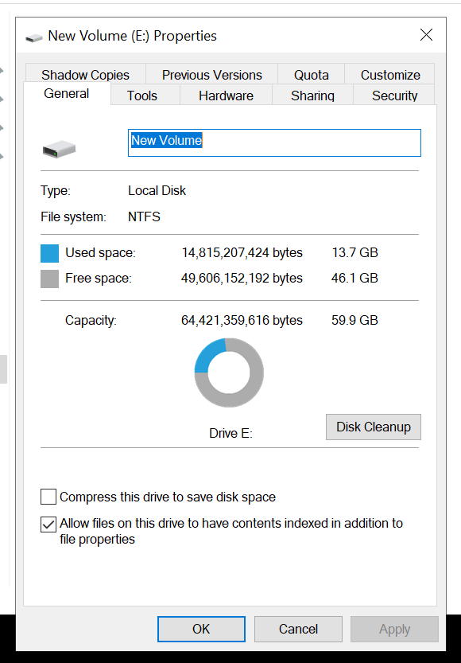

**Test-Restore OU, users, and group created**

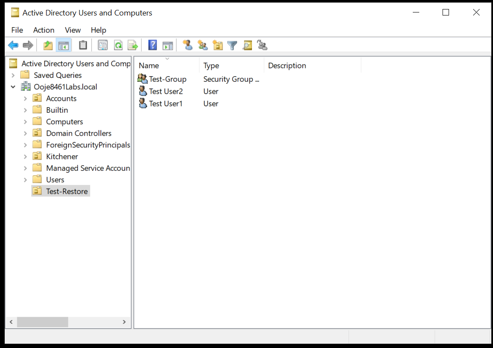

**TestUser1 and TestUser2 added to Test-Group**

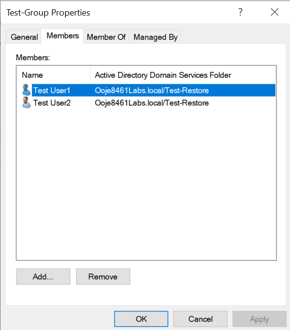

**Windows Server Backup feature installed**

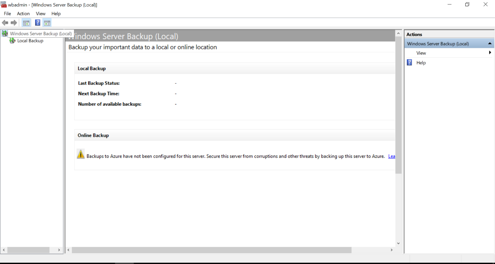

**One-time backup performed — System State to Drive E:**

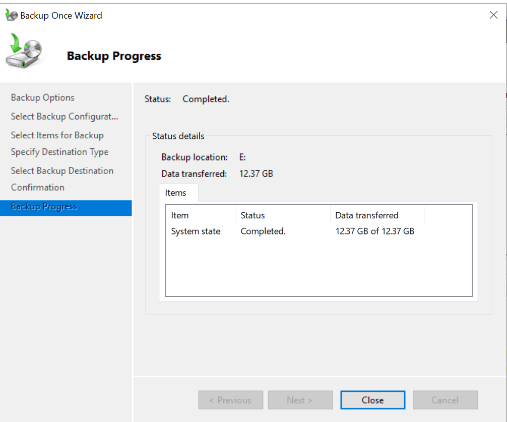

**Test-Restore OU deleted (simulating the incident)**

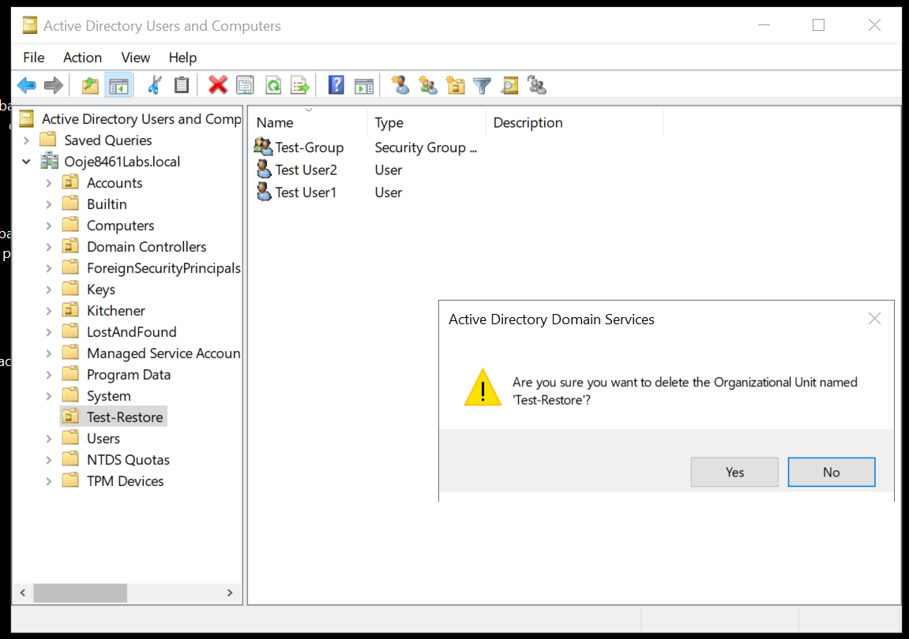

---

## 📋 Part 2 — Authoritative Restore

### Why "Authoritative" Matters

In an AD environment with multiple domain controllers, a standard restore is **non-authoritative** — meaning AD replication will quickly overwrite the restored data with the "current" (deleted) state from other DCs. The deletion wins.

An **authoritative restore** uses `ntdsutil` to stamp the restored objects with a USN higher than anything in the domain — forcing all other DCs to accept the restored data as the truth, overriding the deletion.

### The Recovery Process

```
Step 1: Configure server to boot into Directory Services Restore Mode (DSRM)
Step 2: Reboot into safe mode / DSRM
Step 3: Restore System State backup using Windows Server Backup
Step 4: Launch ntdsutil
Step 5: Enter "activate instance ntds"
Step 6: Enter "authoritative restore"
Step 7: Run "restore subtree CN=Test-Restore,DC=ooje8461Labs,DC=local"
Step 8: Reboot normally
Step 9: Verify OU and objects are restored
```

The USN bump performed by `ntdsutil` during step 7 is what makes this authoritative — AD replication treats the restored objects as newer than the deletion, propagating the recovery to all DCs.

### Screenshots

**System configured to boot into DSRM safe mode**

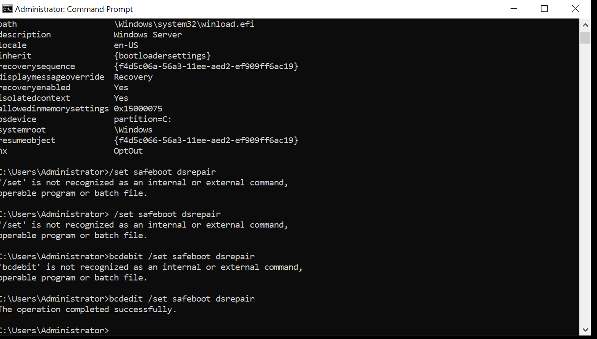

**Server entered safe mode**

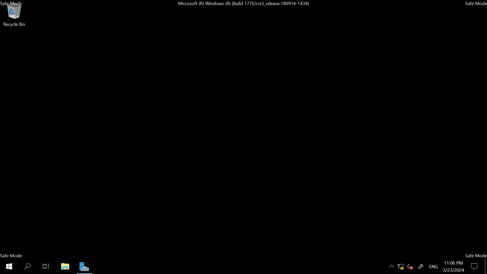

**System State recovery initiated**

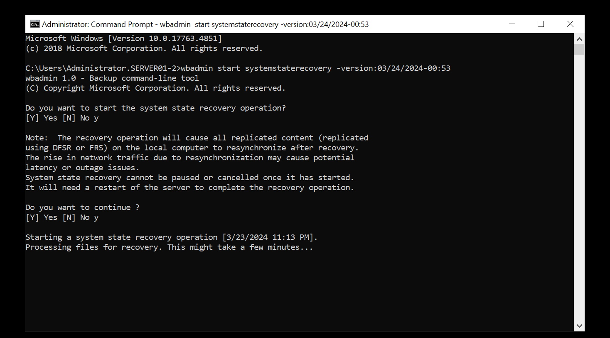

**Entered ntdsutil utility**

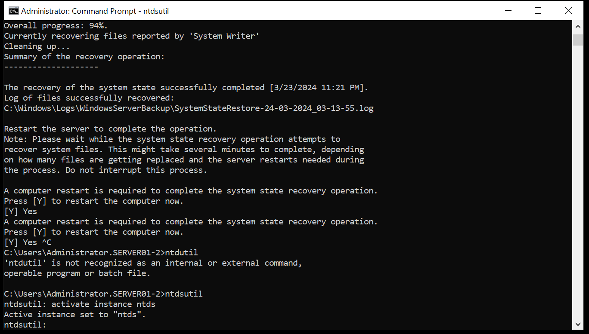

**Entered authoritative restore context in ntdsutil**

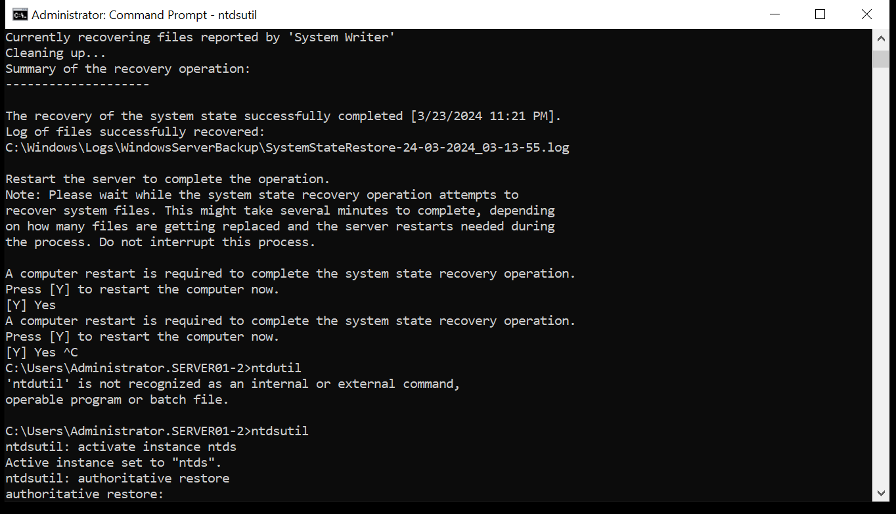

**Restore subtree command executed for Test-Restore OU**

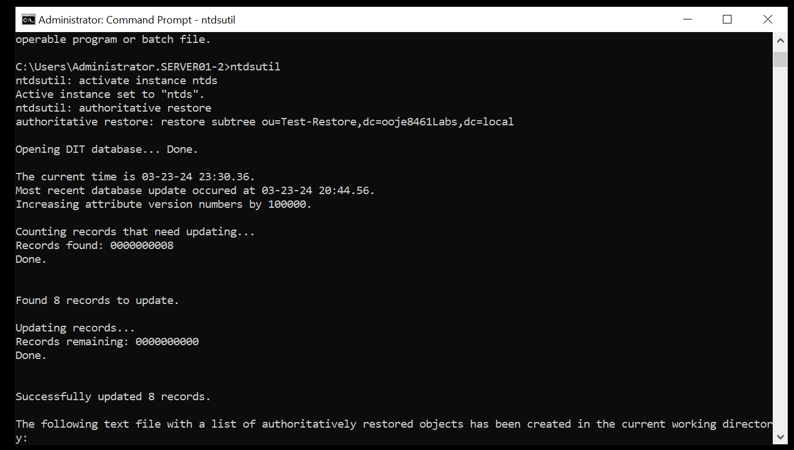

**Recovery completed successfully**

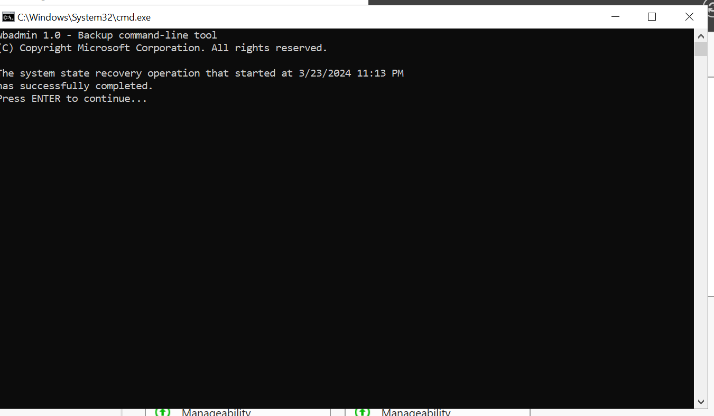

**Test-Restore OU fully recovered in Active Directory**

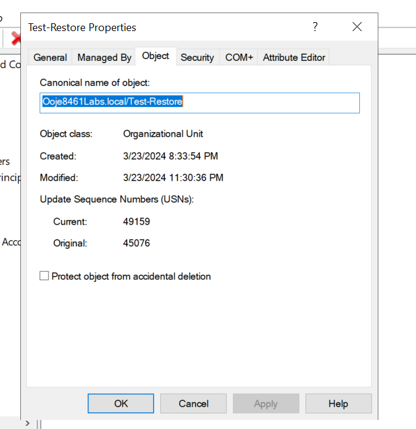

---

## 📊 Recovery Flow Diagram

```
Backup (System State → E:\)
         │
         ▼
Deletion Event (simulated incident)
         │
         ▼
Boot into DSRM (bcdedit /set safeboot dsrepair)
         │
         ▼
Restore System State (Windows Server Backup)
         │
         ▼
Launch ntdsutil
  activate instance ntds
  authoritative restore
  restore subtree CN=Test-Restore,...
         │
         ▼
USN bump applied → replication propagates restored objects
         │
         ▼
Normal Reboot → OU and all objects fully recovered ✅
```

---

## 💡 Key Takeaways

**Disaster recovery competency that matters in production:**

1. **System State backup** is the correct backup method for Active Directory — not file-level or volume-level alone.

2. **Non-authoritative vs. authoritative restore** is a critical distinction. Getting this wrong in production means your recovered objects get deleted again by replication within minutes.

3. **ntdsutil** is the authoritative AD management tool. I know how to use it in DSRM to perform object-level recovery — one of the more advanced Windows Server skills.

4. **USN (Update Sequence Number)** is the mechanism that drives AD replication decisions. Understanding it is what makes authoritative restore logical rather than magical.

5. **Business continuity** — organizations that don't have tested, current AD backups are one misclick away from a catastrophic event. I know how to prevent that and recover from it.

---

[← Lab 04: WSUS](../04-wsus-patch-management/README.md) | [Next: Capstone Project →](../06-capstone-enterprise-project/README.md)
