# Security Hardening: Microsoft Security Compliance Toolkit

> *Final Exam · INFO 8461 · Windows Infrastructure and Security*
> *Scenario: Senior Windows Endpoint Security Engineer — Major Canadian Bank*

---

## 🎯 The Scenario

> *"You're about to be given the job of a Senior Windows Endpoint Security Engineer with one of the biggest banks in Canada. Your duty is to prove to the hiring team that you're worthy of this role. You have been tasked to harden a Windows Server that is freshly promoted to a Domain Controller."*
>
> *— Exam Instructions*

This was the final exam. Under time pressure, with no lab guide, using only live VM access via RDP — I had to demonstrate real-world security hardening competency using the **Microsoft Security Compliance Toolkit (MSCT)**.

This isn't theory. This is what I can do.

---

## 🛡️ Tool: Microsoft Security Compliance Toolkit (MSCT)

The MSCT is Microsoft's official security baseline documentation and toolset — the same resource used by enterprise security teams to harden Windows environments against industry benchmarks. It provides:

- Pre-configured security baselines for each Windows Server/OS version
- GPO templates aligned with CIS benchmarks and Microsoft's own hardening guidance
- Documentation spreadsheets listing every recommended policy setting

**Download:** [Microsoft MSCT — microsoft.com](https://www.microsoft.com/en-us/download/details.aspx?id=55319)

---

## 📋 Task 1 — Download the Correct Toolkit

**Action:** Created a folder named `8917862` on the VM desktop, downloaded the MSCT version matching the server's OS (Windows Server 2019), confirmed the correct toolkit was in place.

The version match matters. Applying a Windows Server 2016 baseline to a 2019 DC can introduce mismatches. I selected the correct version for the target environment.

### Screenshot

**Correct toolkit downloaded into student ID folder**

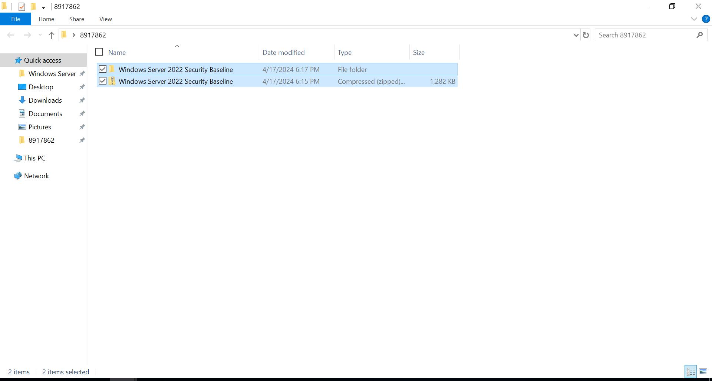

---

## 📋 Task 2 — Identify GPO Configuration Sheets

**Action:** Unzipped the toolkit, navigated to the `Documentation` folder, opened the `FINAL-MS*.xlsx` file.

**Two sheets identified for GPO configuration:**

| Sheet | Purpose |
|-------|---------|
| **Computer** | Machine-level settings — applied at the computer object level |
| **User** | User-level settings — applied to user accounts |

**5 proposed GPO settings from Computer sheet:**

1. Prevent changing start menu background
2. Prevent changing lock screen and logon image
3. Apply the default account picture to all users
4. **Password Settings** ← Selected for implementation
5. **Configure automatic updates** ← Selected for implementation

**5 proposed GPO settings from User sheet:**

1. Hide the Programs Control Panel
2. Hide and disable all items on the desktop
3. **Desktop Wallpaper** ← Selected for implementation
4. Add/Delete items
5. **Enable Active Desktop** ← Selected for implementation

### Screenshot

**MSCT Excel documentation with Computer and User sheets visible**

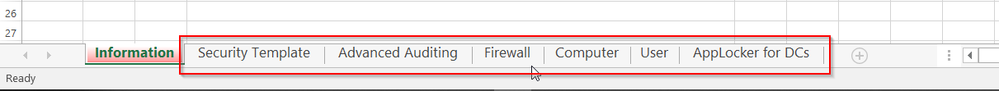

---

## 📋 Task 3 — Implement 4 GPOs (Without Using Default Domain Policy)

> **Constraint:** Must NOT use the Default Domain Policy. A separate GPO must be created for each setting. This is best practice — modifying the Default Domain Policy is a widely recognized anti-pattern that creates unpredictable side effects.

---

### GPO 1: Password Policy (Computer)

**Setting:** Password Settings — minimum length, complexity, maximum age
**Business Justification:** A banking environment requires strict password controls. Weak passwords are the #1 vector for unauthorized access. This GPO enforces password length and age requirements across all domain users.

**Configuration:**
- Minimum password age set
- Maximum password length enforced
- Policy linked and verified

**Screenshots**

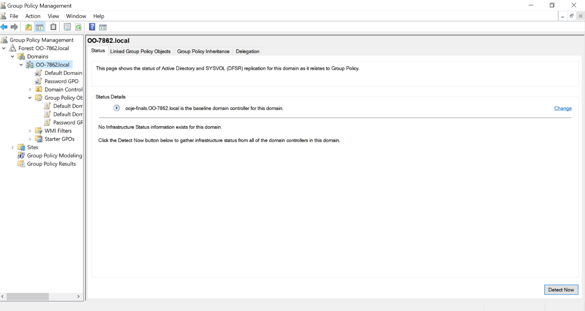

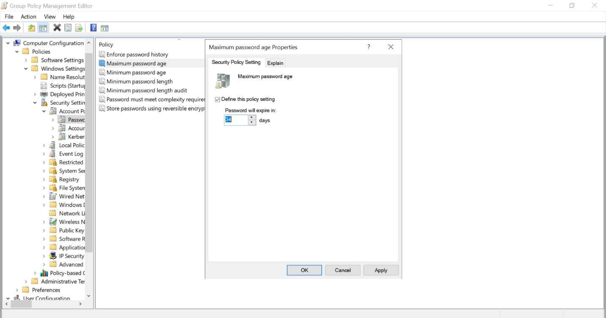

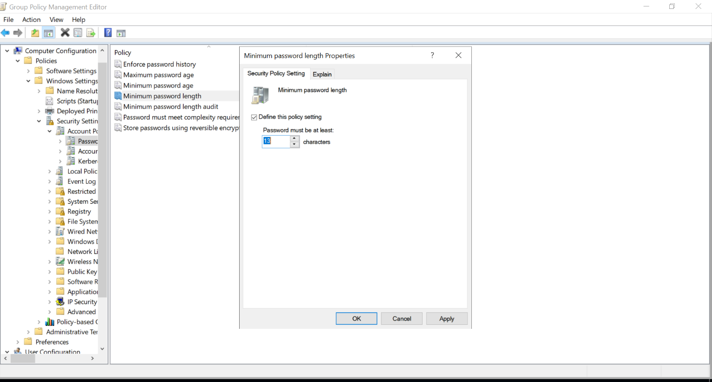

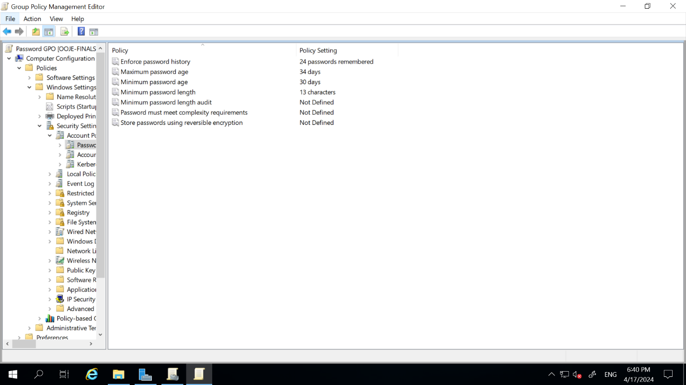

---

### GPO 2: Automatic Updates (Computer)

**Setting:** Configure Automatic Updates
**Business Justification:** In a banking environment, users cannot be trusted to manually apply security patches. Unpatched systems represent active security debt. Automatic updates ensure the DC stays current with Microsoft's security patches without requiring administrative intervention for each update cycle.

**Screenshots**

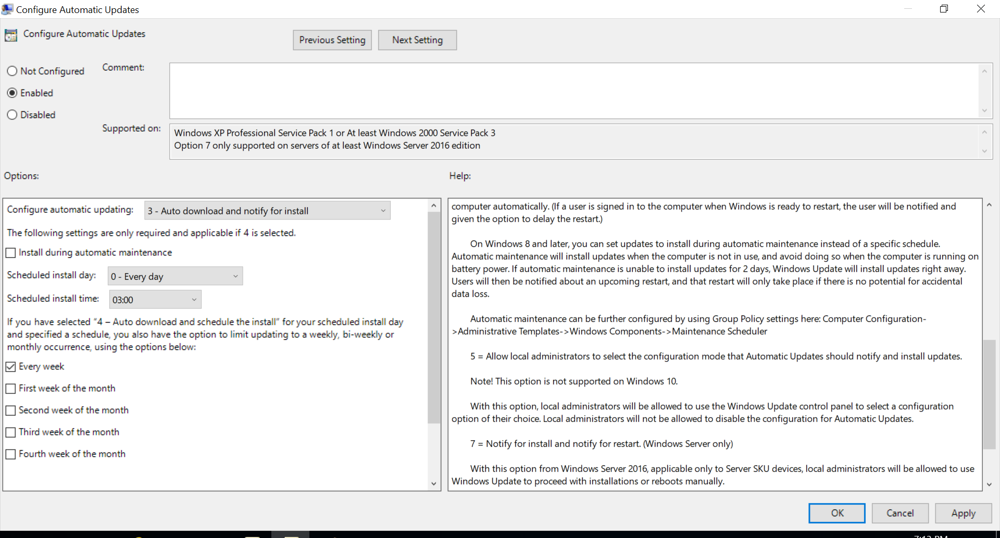

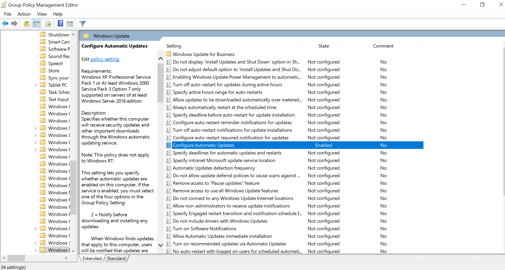

---

### GPO 3: Desktop Wallpaper (User)

**Setting:** Desktop Wallpaper — enable and configure
**Business Justification:** Standardized desktop wallpaper is a professional and compliance-relevant control. It ensures all machines present a consistent, organization-branded appearance (as observed at Conestoga College, where all campus machines share the same wallpaper). It also prevents users from setting inappropriate or distracting backgrounds.

**Screenshot**

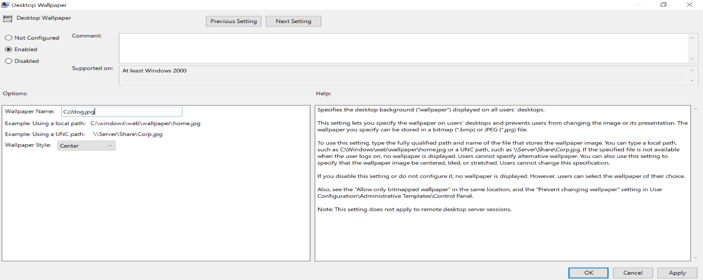

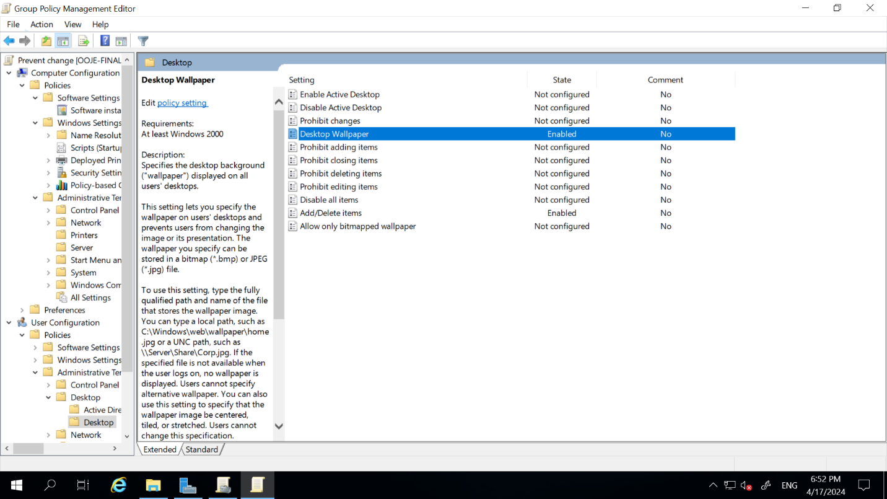

---

### GPO 4: Active Desktop (User)

**Setting:** Enable Active Desktop
**Business Justification:** Controlling Active Desktop settings prevents users from modifying the desktop environment in ways that could introduce security risks (e.g., loading web-based desktop components that could be exploited). Standardizing this setting reduces the attack surface of each endpoint.

**Screenshot**

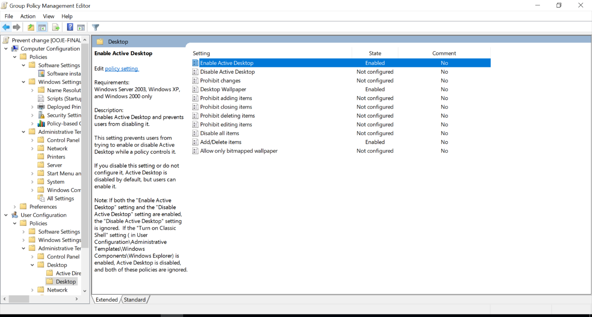

---

## 📋 Task 4 — Security Rationale

### Why These GPOs Were Chosen

**Password Policy**
Strong password requirements are non-negotiable in financial services. Password guessing and credential stuffing attacks are among the most common entry vectors documented by CISA and the Verizon DBIR. A password policy GPO is one of the fastest, highest-impact security controls an engineer can implement.

**Automatic Updates**
Manual patching workflows fail. Humans forget, deprioritize, or lose track. In a banking DC environment, every day an unpatched vulnerability exists is a day the organization is exposed. Automatic updates eliminate that gap for critical patches.

**Desktop Wallpaper**
This is a professional control with compliance implications. Regulatory frameworks like PCI-DSS and SOC 2 require evidence of a consistent, controlled desktop environment. Standardized wallpaper also aids incident response — non-standard desktops can indicate unauthorized access or tampering.

**Active Desktop**
Restricting Active Desktop configurations prevents users from inadvertently loading web content onto the desktop — a potential vector for browser-based exploits to gain desktop-level access.

---

## 📊 MSCT Hardening Summary

```
Windows Server 2019 — Freshly Promoted DC
          │
          ▼
Microsoft Security Compliance Toolkit
  → Documentation/FINAL-MS*.xlsx
    → Computer sheet: machine-level baselines
    → User sheet: user-level baselines
          │
          ▼
4 GPOs Implemented (separate from Default Domain Policy):
  1. Password Policy      → Minimum length, complexity, age
  2. Automatic Updates    → No manual intervention required
  3. Desktop Wallpaper    → Consistent, professional, controlled
  4. Active Desktop       → Prevents web-based desktop vectors
```

---

## 💡 What This Exam Demonstrated

1. **Independent research under pressure** — Given only a toolkit URL and a scenario, I identified the right tool, the right version, and the right settings to implement.

2. **Security reasoning** — I didn't just apply settings. I articulated *why* each setting matters in a high-security environment like a bank's DC.

3. **Best practices adherence** — Implementing GPOs in separate policies (not Default Domain Policy) demonstrates understanding of enterprise AD management standards.

4. **MSCT literacy** — Navigating the MSCT Excel documentation, identifying which sheets apply to Computer vs. User settings, and translating that into live GPO configurations is a practical skill used in enterprise hardening engagements.

---

[← Capstone Project](../06-capstone-enterprise-project/README.md) | [Back to Portfolio Home →](../README.md)
